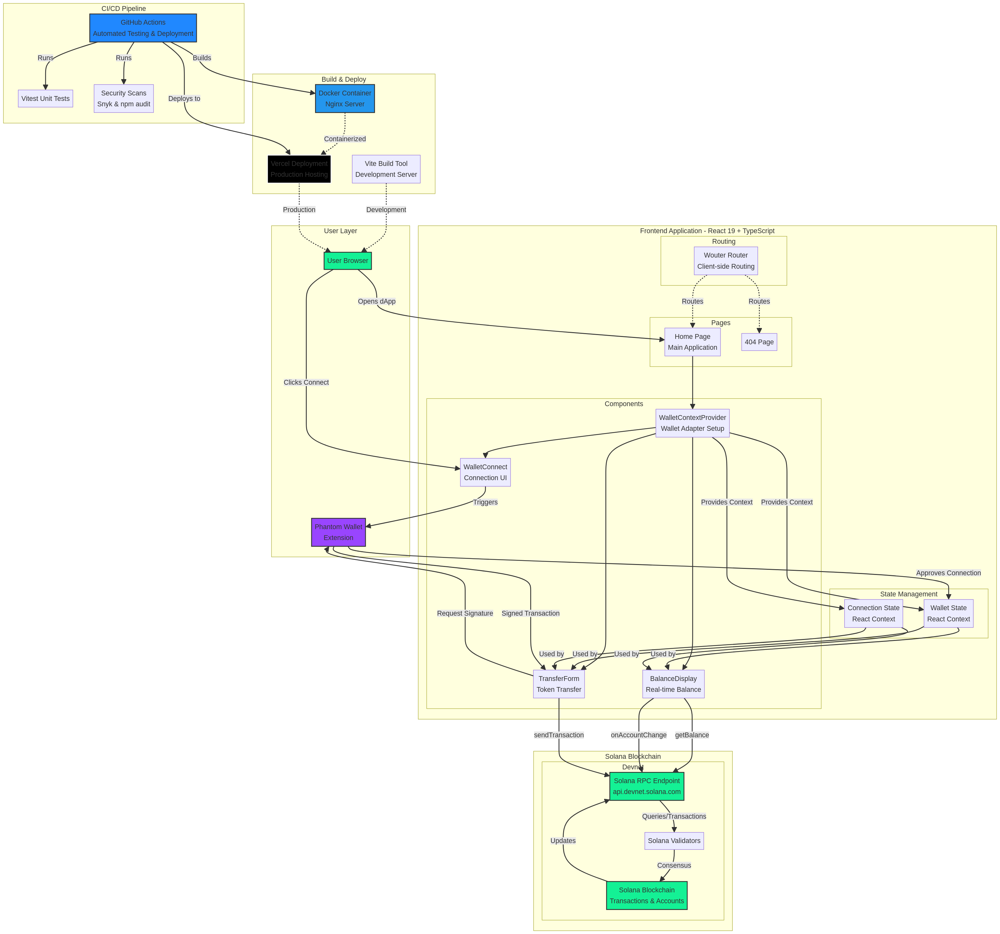

# Solana dApp PoC - Decentralized Transaction Protocol

[](https://reactjs.org/)
[](https://www.typescriptlang.org/)
[](https://solana.com/)
[](https://vitejs.dev/)
[](https://www.docker.com/)
[](https://github.com/mlakhoua-rgb/solana-dapp-poc/actions)
[](LICENSE)

A production-ready proof-of-concept decentralized application (dApp) built on the Solana blockchain. This project demonstrates secure wallet connection, real-time balance tracking, and SOL token transfers on Solana Devnet using a modern cyberpunk-inspired interface.

**Live Demo:** [Coming Soon - Deploying to Vercel]

**GitHub Repository:** [https://github.com/mlakhoua-rgb/solana-dapp-poc](https://github.com/mlakhoua-rgb/solana-dapp-poc)

---

## 🎯 Project Overview

This dApp serves as a foundational template for building Web3 applications on Solana. It provides developers with a working example of wallet integration, balance queries, and transaction execution—three core functionalities required in most blockchain applications.

**Key Features:**
- **Wallet Connection**: Multi-wallet support with Phantom wallet adapter
- **Real-Time Balance Display**: Live SOL balance updates with subscription-based monitoring
- **Secure Transfers**: Send SOL to any Solana address with transaction confirmation
- **Devnet Testing**: Pre-configured for Solana Devnet for safe experimentation
- **Cyberpunk UI**: Dark-themed interface with neon accents reflecting the high-speed nature of Solana
- **Docker Support**: Containerized deployment with Docker and Docker Compose
- **CI/CD Pipeline**: Automated testing and deployment with GitHub Actions
- **Comprehensive Testing**: Unit tests with Vitest and React Testing Library

---

## 🏗️ Architecture Overview

The project follows a client-side React architecture with comprehensive testing and deployment automation.



### Component Architecture

The application is structured around four main layers that work together to provide a seamless Web3 experience. The **User Layer** handles wallet interactions through the Phantom browser extension, while the **Frontend Application** manages state and UI components using React 19 with TypeScript. The **Solana Blockchain** layer communicates with Devnet validators through RPC endpoints for balance queries and transaction submissions. Finally, the **Build & Deploy** layer utilizes Vite for development, Docker for containerization, and Vercel for production hosting.

The component hierarchy begins with the **WalletContextProvider** that wraps the entire application, providing wallet and connection state through React Context. Child components like **WalletConnect**, **BalanceDisplay**, and **TransferForm** consume this context to interact with the Solana blockchain. The **Wouter Router** handles client-side routing between the Home page and 404 error page.

Real-time blockchain interactions are achieved through Solana's RPC methods. The **BalanceDisplay** component uses `getBalance()` for initial balance fetching and `onAccountChange()` for subscribing to live updates. The **TransferForm** component constructs transactions using `SystemProgram.transfer()` and submits them via `sendTransaction()`, with all transaction signing delegated to the Phantom wallet for security.

---

## 📦 Technology Stack

### Core Framework
- **React 19.0.0**: Modern UI library with hooks and functional components
- **TypeScript 5.6.3**: Type-safe JavaScript for robust development
- **Vite 7.1.7**: Lightning-fast build tool and dev server

### Solana Integration
- **@solana/web3.js 1.98.4**: Official Solana JavaScript library for blockchain interaction
- **@solana/wallet-adapter-react 0.15.39**: React hooks for wallet management
- **@solana/wallet-adapter-react-ui 0.9.39**: Pre-built wallet UI components
- **@solana/wallet-adapter-phantom 0.9.28**: Phantom wallet support
- **@solana/wallet-adapter-wallets 0.19.37**: Multi-wallet adapter support
- **vite-plugin-node-polyfills 0.24.0**: Browser polyfills for Node.js modules

### UI & Styling
- **Tailwind CSS 4.1.14**: Utility-first CSS framework
- **shadcn/ui**: Accessible React component library built on Radix UI
- **Lucide React 0.453.0**: Beautiful SVG icon library
- **Sonner 2.0.7**: Toast notification system
- **Framer Motion 12.23.22**: Animation library

### Form & Validation
- **React Hook Form 7.64.0**: Efficient form state management
- **Zod 4.1.12**: TypeScript-first schema validation
- **@hookform/resolvers 5.2.2**: Integration between React Hook Form and Zod

### Testing
- **Vitest 2.1.4**: Fast unit testing framework
- **@testing-library/react**: React component testing utilities
- **@vitest/coverage-v8**: Code coverage reporting

### Routing
- **Wouter 3.3.5**: Lightweight client-side router for React

### Development Tools
- **Prettier 3.6.2**: Code formatter
- **ESBuild 0.25.0**: JavaScript bundler
- **Docker**: Containerization for consistent deployments
- **GitHub Actions**: CI/CD automation

---

## 🚀 Getting Started

### Prerequisites
- **Node.js 18+** or **pnpm 10.4.1+**
- **Phantom Wallet** or compatible Solana wallet extension
- **Solana Devnet SOL** (free from [Solana Faucet](https://faucet.solana.com))
- **Docker** (optional, for containerized deployment)

### Installation

1. **Clone the repository:**
   ```bash
   git clone https://github.com/mlakhoua-rgb/solana-dapp-poc.git
   cd solana-dapp-poc
   ```

2. **Install dependencies:**
   ```bash
   pnpm install
   ```

3. **Start the development server:**
   ```bash
   pnpm dev
   ```

   The application will be available at `http://localhost:3000`

4. **Build for production:**
   ```bash
   pnpm build
   ```

5. **Run production build:**
   ```bash
   pnpm start
   ```

### Docker Deployment

1. **Build and run with Docker Compose:**
   ```bash
   docker-compose up -d
   ```

   The application will be available at `http://localhost:3000`

2. **Build Docker image manually:**
   ```bash
   docker build -t solana-dapp-poc .
   docker run -p 3000:80 solana-dapp-poc
   ```

3. **Run with local Solana test validator:**
   ```bash
   docker-compose --profile dev up -d
   ```

---

## 🧪 Testing

### Run Tests

```bash
# Run all tests
pnpm test

# Run tests in watch mode
pnpm test:watch

# Run tests with coverage
pnpm test:coverage

# Type checking
pnpm check

# Format code
pnpm format
```

### Test Structure

The project uses **Vitest** for unit testing with **React Testing Library** for component testing. Tests are located in `client/src/__tests__/` and follow the naming convention `*.test.tsx`.

**Test Coverage Goals:**
- Components: 80%+
- Utilities: 90%+
- Overall: 75%+

---

## 🔧 Key Components

### WalletContextProvider

**File:** `client/src/components/WalletContextProvider.tsx`

This component wraps the entire application with Solana wallet context. It initializes the connection provider, wallet provider, and modal provider.

```typescript
export const WalletContextProvider: FC<{ children: ReactNode }> = ({ children }) => {
  const network = WalletAdapterNetwork.Devnet;
  const endpoint = useMemo(() => clusterApiUrl(network), [network]);
  const wallets = useMemo(() => [new PhantomWalletAdapter()], [network]);

  return (
    <ConnectionProvider endpoint={endpoint}>
      <WalletProvider wallets={wallets} autoConnect>
        <WalletModalProvider>{children}</WalletModalProvider>
      </WalletProvider>
    </ConnectionProvider>
  );
};
```

**Key Responsibilities:**
- Establishes RPC connection to Solana Devnet
- Manages wallet adapters (currently Phantom)
- Provides wallet context to child components via React Context

### WalletConnect

**File:** `client/src/components/WalletConnect.tsx`

Renders the wallet connection button with visual feedback.

**Features:**
- Multi-wallet selector modal
- Connection status indicator
- Responsive design with hidden address on mobile

### BalanceDisplay
**File:** `client/src/components/BalanceDisplay.tsx`

Displays the connected wallet's SOL balance with real-time updates.

```typescript
const getBalance = async () => {
  const bal = await connection.getBalance(publicKey);
  setBalance(bal / LAMPORTS_PER_SOL);
};

// Subscribe to account changes for real-time updates
const id = connection.onAccountChange(publicKey, (accountInfo) => {
  setBalance(accountInfo.lamports / LAMPORTS_PER_SOL);
});
```

**Key Features:**
- Fetches balance using `connection.getBalance()`
- Subscribes to account changes for live updates
- Converts lamports to SOL (1 SOL = 1,000,000,000 lamports)
- Displays network status and connection indicators

### TransferForm

**File:** `client/src/components/TransferForm.tsx`

Handles SOL transfers with validation and error handling.

```typescript
const handleTransfer = async (e: React.FormEvent) => {
  const recipientPubKey = new PublicKey(recipient);
  const lamports = parseFloat(amount) * LAMPORTS_PER_SOL;

  const transaction = new Transaction().add(
    SystemProgram.transfer({
      fromPubkey: publicKey,
      toPubkey: recipientPubKey,
      lamports,
    })
  );

  const signature = await sendTransaction(transaction, connection);
};
```

**Key Features:**
- Form validation using React Hook Form
- Public key validation
- Amount conversion (SOL to lamports)
- Transaction signing via wallet
- Confirmation with transaction signature
- Link to Solana Explorer for verification

---

## 🎨 Design System

### Neon Cyber-Solana Theme

The application uses a dark cyberpunk aesthetic with neon green and purple accents:

| Element | Color | Purpose |
|---------|-------|---------|
| Background | `#050505` (Deep Void Black) | Primary background |
| Foreground | `#FFFFFF` (Stark White) | Text and primary content |
| Primary Accent | `#14F195` (Neon Green) | Call-to-action, highlights |
| Secondary Accent | `#9945FF` (Neon Purple) | Form elements, secondary actions |
| Card Background | `#1A1A1A` (Dark Gunmetal) | Component containers |

### CSS Custom Properties

Global theme variables are defined in `client/src/index.css` using OKLCH color space for better color consistency across browsers.

```css
:root {
  --background: oklch(0.05 0 0);
  --foreground: oklch(0.98 0 0);
  --primary: oklch(0.85 0.2 145);
  --secondary: oklch(0.2 0.05 280);
}
```

---

## 🔐 Security Considerations
### Wallet Security
- **No Private Key Storage**: The application never stores or handles private keys. All signing is delegated to the wallet extension.
- **Wallet Adapter Pattern**: Uses the standard Solana Wallet Adapter for secure wallet communication.

### Transaction Validation
- **Public Key Validation**: Recipient addresses are validated as valid Solana public keys before transaction submission.
- **Amount Validation**: Transfer amounts are validated to prevent negative or zero transfers.
- **User Confirmation**: All transactions require explicit user confirmation through the wallet extension.

### Network Configuration
- **Devnet Only**: The PoC is configured for Solana Devnet to prevent accidental mainnet transactions.
- **RPC Endpoint**: Uses the official Solana public RPC endpoint for reliability.

---

## 📡 Solana RPC Methods Used

The application leverages the following Solana RPC methods:

| Method | Purpose | Usage |
|--------|---------|-------|
| `getBalance()` | Fetch SOL balance | `BalanceDisplay.tsx` |
| `onAccountChange()` | Subscribe to balance updates | `BalanceDisplay.tsx` |
| `sendTransaction()` | Submit signed transaction | `TransferForm.tsx` |
| `getSignaturesForAddress()` | Fetch transaction history | Future feature |

---

## 🔗 CI/CD Pipeline

### GitHub Actions Workflow

The `.github/workflows/ci-cd.yml` workflow provides comprehensive automation:

**On Pull Request:**
1. Lint and format checking with Prettier
2. TypeScript type checking
3. Unit test execution with coverage reporting
4. Build verification
5. Docker image build
6. Security scanning with Snyk and npm audit
7. Preview deployment to Vercel

**On Push to Main:**
1. All PR checks
2. Docker image push to Docker Hub
3. Production deployment to Vercel

### Setting Up CI/CD

Add the following secrets to your GitHub repository:

**Required Secrets:**
- `VERCEL_TOKEN`: Vercel authentication token
- `VERCEL_ORG_ID`: Vercel organization ID
- `VERCEL_PROJECT_ID`: Vercel project ID

**Optional Secrets:**
- `DOCKER_USERNAME`: Docker Hub username
- `DOCKER_PASSWORD`: Docker Hub password or access token
- `SNYK_TOKEN`: Snyk security scanning token

---

## 🚢 Deployment

### Vercel Deployment (Recommended)

1. **Install Vercel CLI:**
   ```bash
   npm install -g vercel
   ```

2. **Login to Vercel:**
   ```bash
   vercel login
   ```

3. **Deploy:**
   ```bash
   vercel --prod
   ```

### Docker Deployment

1. **Build and push to Docker Hub:**
   ```bash
   docker build -t yourusername/solana-dapp-poc .
   docker push yourusername/solana-dapp-poc
   ```

2. **Deploy to any container platform:**
   - AWS ECS/Fargate
   - Google Cloud Run
   - Azure Container Instances
   - DigitalOcean App Platform

### Environment Variables

The application uses the following environment variables:

```
VITE_APP_TITLE=Solana dApp PoC
VITE_APP_LOGO=<logo-url>
VITE_ANALYTICS_ENDPOINT=<analytics-endpoint>
VITE_ANALYTICS_WEBSITE_ID=<analytics-id>
```

---

## 🔄 Common Issues & Solutions

### Issue: "Wallet not connected" error
**Solution:** Ensure Phantom wallet extension is installed and you've clicked "Select Wallet" to connect.

### Issue: "Invalid recipient address"
**Solution:** Verify the recipient address is a valid 44-character base58 Solana public key.

### Issue: "Insufficient balance"
**Solution:** Request free SOL from the [Solana Faucet](https://faucet.solana.com) for Devnet testing.

### Issue: Transaction fails with "Blockhash not found"
**Solution:** This is a temporary network issue. Wait a moment and retry the transaction.

### Issue: Docker build fails
**Solution:** Ensure Docker is running and you have sufficient disk space. Try `docker system prune` to clean up.

---

## 📚 Learning Resources

- **Solana Documentation**: [https://docs.solana.com](https://docs.solana.com)
- **Web3.js API Reference**: [https://solana-labs.github.io/solana-web3.js/](https://solana-labs.github.io/solana-web3.js/)
- **Wallet Adapter Guide**: [https://github.com/solana-labs/wallet-adapter](https://github.com/solana-labs/wallet-adapter)
- **Solana Explorer**: [https://explorer.solana.com](https://explorer.solana.com)
- **Phantom Wallet**: [https://phantom.app](https://phantom.app)

---

## 🛣️ Roadmap

**Phase 2 Features:**
- Transaction history display
- SPL token transfer support
- Network switcher (Devnet/Testnet/Mainnet)
- Transaction fee estimation
- Advanced transaction options (memo, custom fees)

**Phase 3 Features:**
- NFT minting interface
- Token swap integration
- Staking interface
- Multi-sig wallet support
- Solana program (smart contract) integration

---

## 📁 Project Structure

```
solana-dapp-poc/
├── client/
│   ├── src/
│   │   ├── components/
│   │   │   ├── WalletContextProvider.tsx
│   │   │   ├── WalletConnect.tsx
│   │   │   ├── BalanceDisplay.tsx
│   │   │   ├── TransferForm.tsx
│   │   │   └── ui/                    # shadcn/ui components
│   │   ├── pages/
│   │   │   ├── Home.tsx
│   │   │   └── NotFound.tsx
│   │   ├── __tests__/                 # Test files
│   │   │   ├── setup.ts
│   │   │   └── components/
│   │   ├── App.tsx
│   │   ├── main.tsx
│   │   └── index.css
│   ├── index.html
│   └── public/
├── server/
│   └── index.ts
├── .github/
│   └── workflows/
│       └── ci-cd.yml                  # CI/CD pipeline
├── Dockerfile                         # Docker configuration
├── docker-compose.yml                 # Docker Compose setup
├── nginx.conf                         # Nginx configuration
├── vitest.config.ts                   # Vitest configuration
├── vite.config.ts                     # Vite build configuration
├── package.json
├── pnpm-lock.yaml
├── tsconfig.json
├── ARCHITECTURE_DIAGRAM.mmd           # Architecture diagram (Mermaid)
├── ARCHITECTURE_DIAGRAM.png           # Architecture diagram (PNG)
├── ARCHITECTURE.md                    # Detailed architecture docs
├── CODE_STRUCTURE.md                  # Code structure documentation
├── DEPENDENCIES.md                    # Dependencies documentation
├── SETUP.md                           # Setup guide
└── README.md                          # This file
```

---

## 📄 License

This project is licensed under the MIT License. See the LICENSE file for details.

---

## 👨‍💻 Development

### Code Style
- TypeScript for type safety
- Functional components with React hooks
- Tailwind utility classes for styling
- Component-based architecture
- Comprehensive test coverage

### Contributing
Contributions are welcome! Please follow these guidelines:
1. Fork the repository
2. Create a feature branch (`git checkout -b feature/amazing-feature`)
3. Write tests for new features
4. Ensure all tests pass (`pnpm test`)
5. Format code (`pnpm format`)
6. Commit changes (`git commit -m 'Add amazing feature'`)
7. Push to branch (`git push origin feature/amazing-feature`)
8. Open a Pull Request

---

## 📞 Support

For issues, questions, or suggestions, please open an issue on the GitHub repository or contact the development team.

---

**Built with ❤️ by Manus AI**

*Last Updated: January 2026*
